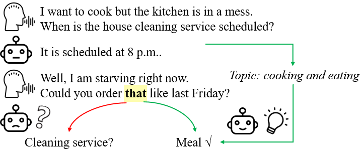
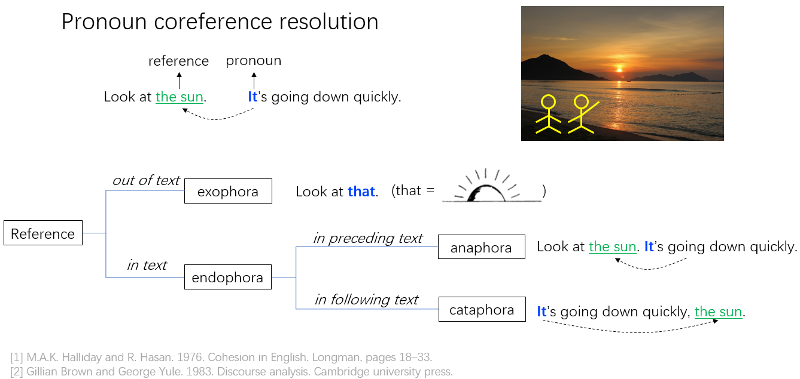
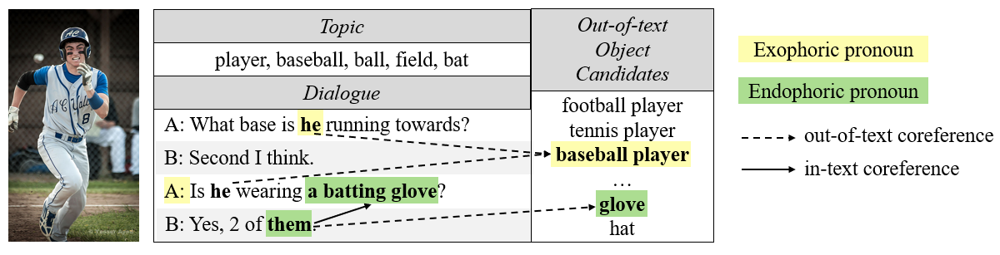

# Exophoric Pronoun Resolution in Dialogues with Topic Regularization

## Introduction
This is the data and the source code for the EMNLP 2021 paper "Exophoric Pronoun Resolution in Dialogues with Topic Regularization."[[PAPER](https://arxiv.org/abs/2109.04787)][[VIDEO](https://drive.google.com/file/d/10a5dICXJi_QlsaM7Ar5lcx95co3CYz3s/view?usp=sharing)][[SLIDES](https://drive.google.com/file/d/1TVMN9VI63cS0fDkvUuvaN-V1n49dwhav/view?usp=sharing)][[POSTER](https://drive.google.com/file/d/1DOMT3tzPDeljoNdP1RqyDPOeg30G0PO_/view?usp=sharing)]

### Abstract
Resolving pronouns to their referents has long been studied as a fundamental natural language understanding problem. Previous works on pronoun coreference resolution (PCR) mostly focus on resolving pronouns to mentions in text while ignoring the exophoric scenario. Exophoric pronouns are common in daily communications, where speakers may directly use pronouns to refer to some objects present in the environment without introducing the objects first. Although such objects are not mentioned in the dialogue text, they can often be disambiguated by the general topics of the dialogue. Motivated by this, we propose to jointly leverage the local context and global topics of dialogues to solve the out-of-text PCR problem. Extensive experiments demonstrate the effectiveness of adding topic regularization for resolving exophoric pronouns.

<div align=center>

</div>

An example of resolving <font color=yellow>exophoric pronouns</font> in daily dialogues <font color=green>with</font> and <font color=red>without</font> the help of dialogue topics.


### Definition of Exophora

<div align=center>

</div>

In daily dialogues, speakers may often use exophoric pronouns to refer to objects in the environment that all speakers and listeners are aware of without introducing them in the first place. Such use of pronouns is called exophora.

## Task

* Dataset: [VisPro](https://github.com/HKUST-KnowComp/Visual_PCR)
    * It annotates in-text and out-of-text reference for pronouns in visual dialogues.
    * Even without the image, human can resolve 96% of exophoric pronouns in VisPro with only dialogue texts.
* Task definition:
    * Given a pronoun in a dialogue text, find its in-text reference in the dialogue as well as out-of-text reference in an object pool (containing 384 common objects in VisPro).
    * If a pronoun has any in-text reference, such as "them", it is endophoric.
    * If a pronoun only has out-of-text reference, such as “he”, it is exophoric.

<div align=center>

</div>


* How do dialogue topics help？
    * Objects more relevant to the topics are more likely to appear in the environment, such as "baseball player" under this dialogue topic.
    * Our model assigns higher scores to out-of-text objects which are more relevant to the dialogue topics.

## Usage of Model

### Getting Started
* Install python 3.6+ and the following requirements: `pip install -r requirements.txt`.
* Build custom kernels by running `setup_all.sh`.
    * There are 3 platform-dependent ways to build custom TensorFlow kernels. Please comment/uncomment the appropriate lines in the script.


### Preprocessing data

The training, validation, and test split of VisPro contains 4,000, 500, and 500 dialogs, respectively. 

The data preprocessing is described in Sec. 5.4 of the paper. To enable straight reproduction, we upload the preprocessed data files in the `data` folder.

### Evaluation only

* Run `python get_lda.py` to generate LDA topic labels.
* Download model checkpoints of `topic_bert_base` from [checkpoint](https://drive.google.com/drive/folders/1X9ZAxsbIy8g1dipmFAd691sRvG2XPsTT?usp=sharing) to the `logs/topic_bert_base` directory.
* Prediction: `python predict.py topic_bert_base`. Outputs are saved in the `output` directory.
* Evaluation: `python evaluate.py topic_bert_base`.
 
### Training from scratch

* Download pretrained coreference BERT models with `./download_pretrained.sh <model_name>` (bert_base, spanbert_base, bert_large, spanbert_large). This downloads BERT/SpanBERT models finetuned on OntoNotes as the baseline models to `models` folder.
* Run `python get_lda.py` to generate LDA topic labels.
* Experiment configurations are found in `experiments.conf`.
* Choose an experiment that you would like to run, e.g. `topic_bert_base`.
* For training and prediction, set the `GPU` environment variable, which the code treats as shorthand for `CUDA_VISIBLE_DEVICES`.
* Training: `python train.py <experiment>`
* Results are stored in the `logs` directory and can be viewed via TensorBoard.
* Prediction: `python predict.py <experiment>`. Outputs are saved in the `output` directory.
* Evaluation: `python evaluate.py <experiment>`.


## Acknowledgment
We built the training framework based on the original [BERT and SpanBERT for Coreference Resolution](https://github.com/mandarjoshi90/coref).

## Others
If you have questions about the data or the code, you are welcome to open an issue or send me an email, I will respond to that as soon as possible.

The readers are welcome to star/fork this repository and use it to train your own model, reproduce our experiment, and follow our future work. Please kindly cite our paper:
```
@inproceedings{DBLP:conf/emnlp/YuZSZX021,
  author    = {Xintong Yu and
               Hongming Zhang and
               Yangqiu Song and
               Changshui Zhang and
               Kun Xu and
               Dong Yu},
  title     = {Exophoric Pronoun Resolution in Dialogues with Topic Regularization},
  booktitle = {Proceedings of the 2021 Conference on Empirical Methods in Natural
               Language Processing, {EMNLP} 2021, Virtual Event / Punta Cana, Dominican
               Republic, 7-11 November, 2021},
  pages     = {3832--3845},
  publisher = {Association for Computational Linguistics},
  year      = {2021},
  url       = {https://aclanthology.org/2021.emnlp-main.311},
}
```